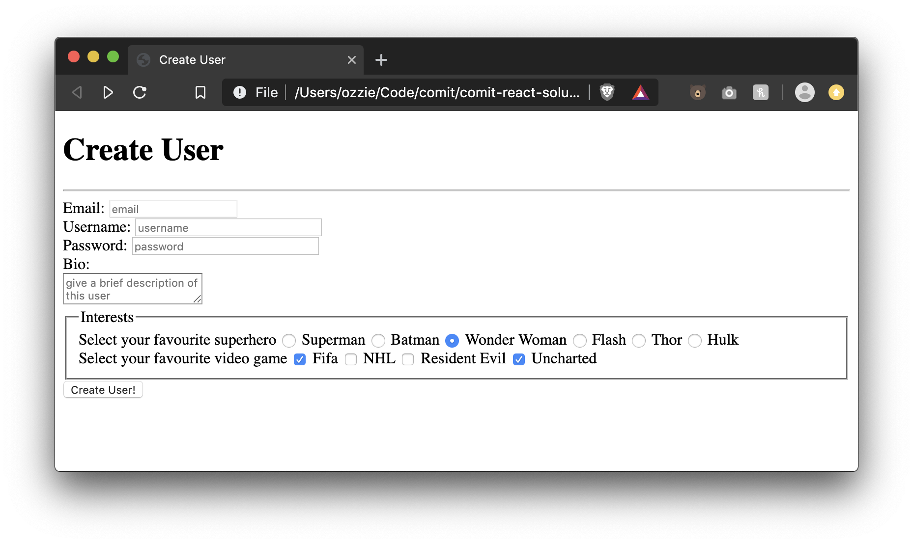
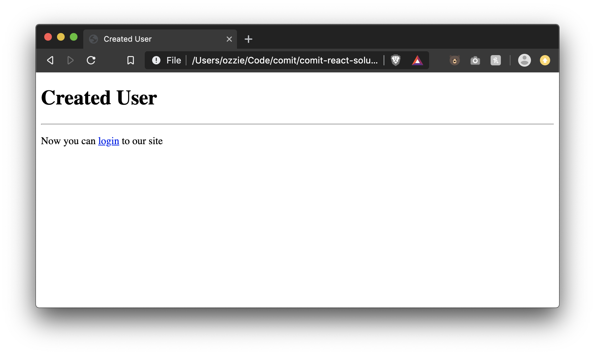

# Forms Assessment Instructions

Create two files
- `index.html`
- `create-user.html`

### index.html

- Add a Document Title: Create User
- Add a Main Title: Create User
- Add an Horizontal Rule
- Create a form element with the following attributes:
  - action: create-user.html
  - method: get
- Inside the form create the following inputs all one above the other, not inline with eachother:
  - Create an email input with the following attributes:
    - name: email
    - placeholder: email
    - Add a label for this input
    - Make the input required
  - Create a text input with the following attributes:
    - name: username
    - placeholder: username
    - size: 30
    - maxlength: 12
    - Add a label for this input
  - Create a password input with the following attributes:
    - name: password
    - size: 30
    - maxlength: 8
    - placeholder: password
    - Add a label for this input
    - Make the input required
  - Create a textarea input with the following attributes:
    - name: bio
    - placeholder: give a brief description of this user
    - Add a label for this input ABOVE the textarea, not on the same line
  - Create a radio button group with the following values:
    - Description: Select your favourite superhero
    - Inputs values and description: Superman, Batman, Wonder Woman, Flash, Thor, Hulk
    - Default selected superhero Wonder Woman
    - Add a label for this input
    - We should only be able to select one of these at a time
  - Create a Checkbox group with the following values:
    - Description: Select your favourite video game
    - Inputs values and description: Fifa, NHL, Resident Evil, Uncharted
    - Default selected video games should be Fifa and Uncharted
    - Inputs name should be videogames
    - Add a label for this input
  - Place a single `<fieldset>` around the checkbox AND radio buttons. Add a `<legend>` "Interests"
  - Create a hidden input with the following attributes:
    - name: userid
    - value: 2300
  - Clicking on any of the above labels should focus the proper inputs
  - Create a submit button with the value "Create User"

### create-user.html

- Add a Document Title: Created User
- Add a Main Title: Created User
- Add a Horizontal Rule
- Add a paragraph with the following text: Now you can login to our site
- Create a fake link (`href="#"`) around the login word from the previous paragraph

# Exercise Result

