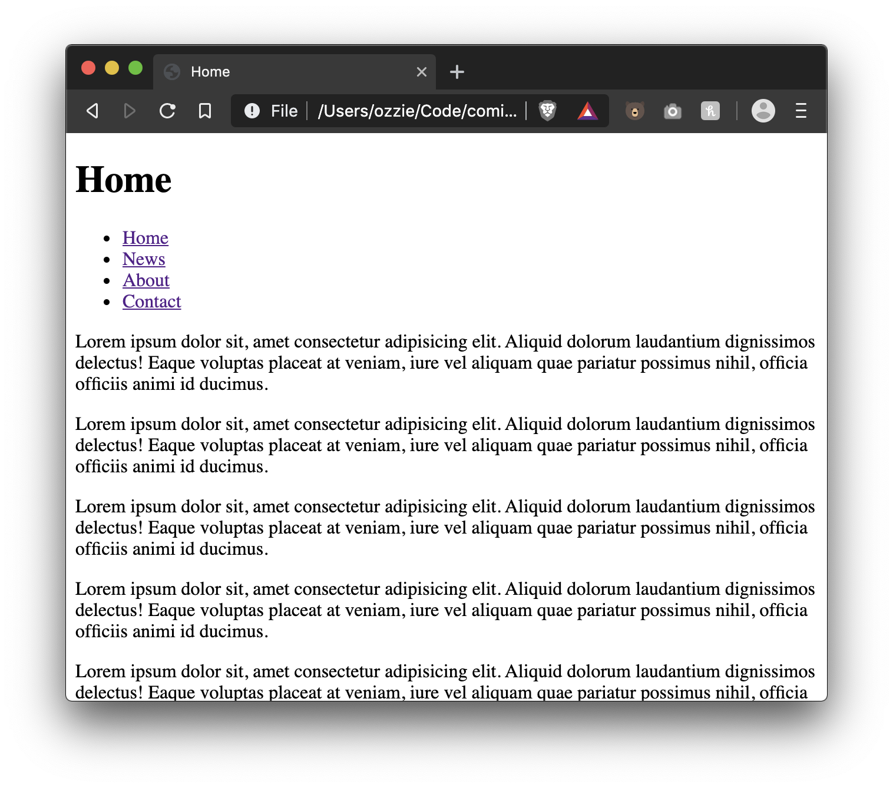
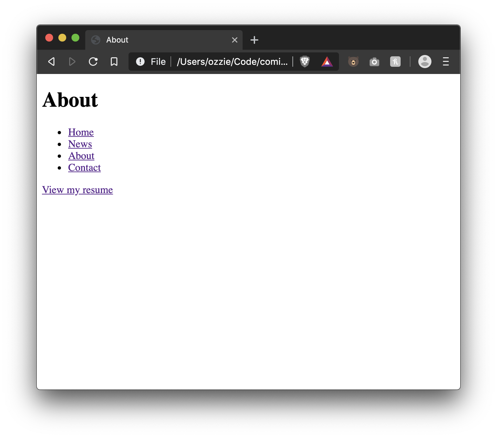
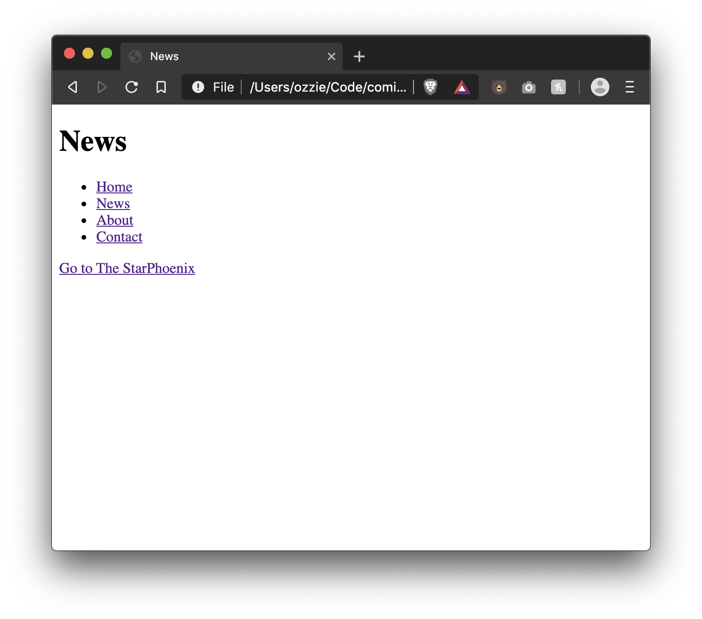
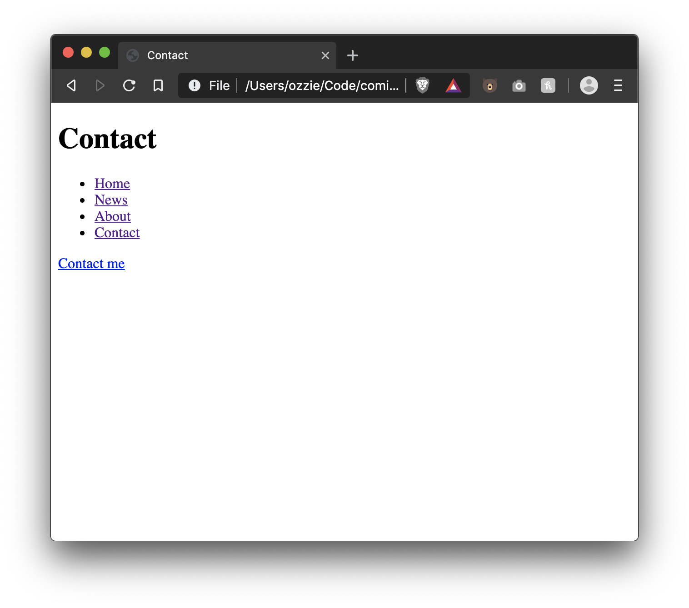
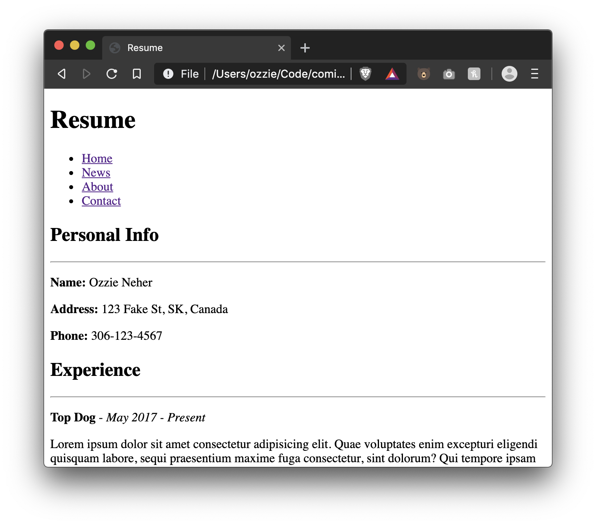

# Links Assessment Instructions

Create the following files
```
/
|-- documents
|   |-- resume.html
|
|-- index.html
|-- news.html
|-- about.html
|-- contact.html
```

- Each HTML document should include:
  - Main title with the document name
  - From each document you should be able to nav to the other documents, example: from index.html you can navigate to news.html, about.html and contact.html
- In index.html place 5 auto-generated paragraphs (you can use: https://www.lipsum.com to generate random text)
- In about.html add a link to resume.html
- The contact.html file will have a `mailto` link with a fake email address and `Contact me` as content
- Create a link to [https://thestarphoenix.com/](https://thestarphoenix.com/) in the news.html document and have it open in a new tab
- Create a fake resume in the resume.html document

# Exercise Result






